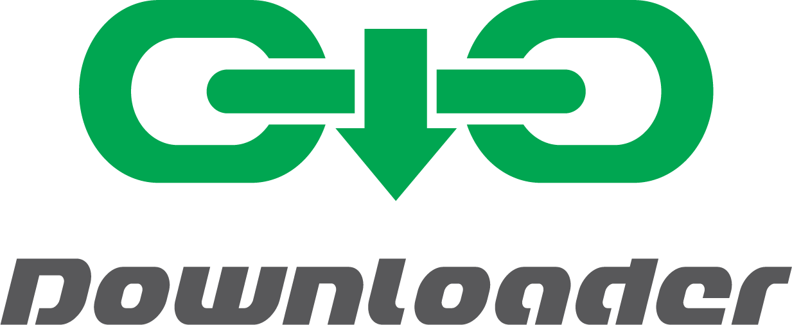

# Downloader

A simple software to download what you want from any URL (direct link, mega.nz and maybe more...) on a locked network.
You'll have to setup Downloader on your **own server**.

**Build with :**
  - Silex 2 (http://silex.sensiolabs.org/)
  - Twig (http://twig.sensiolabs.org/)
  - jQuery (http://jquery.com/)
  - Bootstrap 4 (http://v4-alpha.getbootstrap.com/)

How to setup Downloader
------------

- Download source code on Github
- Run `setup` command with : `npm run setup`
- Update values of *param.yml*
  - *debug* : if you want to see errors
  - *log* : Enable or disabled logs
  - *passModalHash* : `sha256` hash which allow to secure the access to Downloader. To set this hash use : `npm run secure-modal` or copy/paste a `sha256` hash
  - *allowedExtensions* : array of allowed extensions see [param.yml.dist](https://github.com/Strikesoft/Downloader/blob/master/config/param.yml.dist)
  - *downloadfolder* : path to the folder where downloads will be stored
  - *downloadurl* : URL used to create download link
- Setup Apache or Nginx (see examples : [#8](https://github.com/Strikesoft/Downloader/issues/8)) or run `serve` task with : `npm run serve`

License
------------

This project is released under the MIT license. See the complete license in the bundled [LICENSE](https://github.com/Strikesoft/Downloader/blob/master/LICENSE) file.
